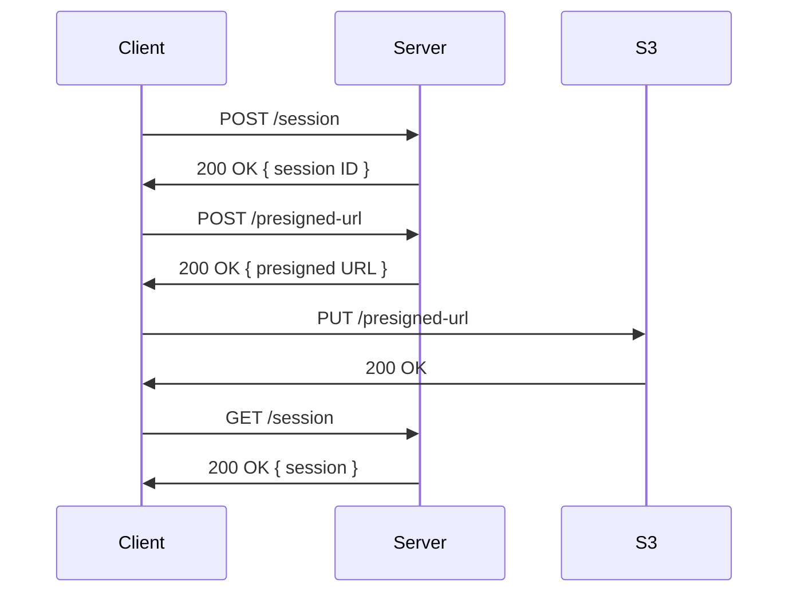

# API

## Endpoints

| Endpoint              | Description                                       |
| --------------------- | ------------------------------------------------- |
| `POST /session`       | Create a new session, returns a session ID        |
| `GET /session`        | Get a session by ID                               |
| `POST /presigned-url` | Create a presigned URL for uploading a file to S3 |

## Sequence Diagrams

