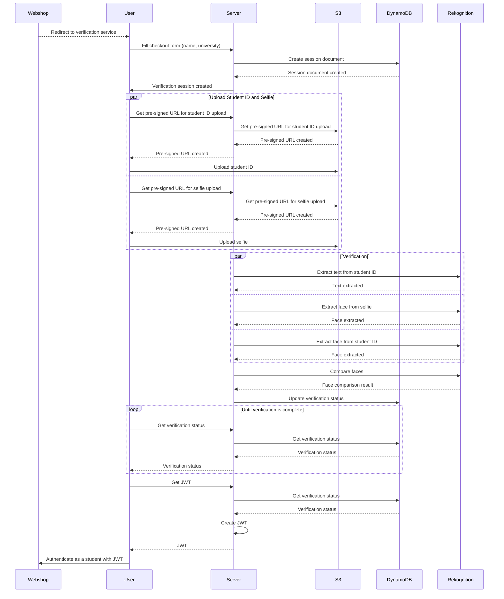

# API

Guiding principles:

- RESTful API
- JSON as the primary data format
- Event-driven architecture
- Strongly asynchronous

## Public Endpoints

| Endpoint                         | Description                                       |
|----------------------------------|---------------------------------------------------|
| `POST /session`                  | Create a new session, returns a session ID        |
| `GET /session`                   | Get all sessions, supports pagination             |
| `GET /session/{id}`              | Get a session by ID                               |
| `GET /session/{id}/jwt`          | Get the verification status of a session as jwt   |
| `POST /presigned-url/selfie`     | Create a presigned URL for uploading a file to S3 |
| `POST /presigned-url/student-id` | Create a presigned URL for uploading a file to S3 |

<details>

<summary>JWT Claims</summary>

```json lines
{
  // session ID
  "sub": "3848a553-c341-4826-974c-6367d7005e0b",
  "name": "John Doe",
  // "student" or "non-student"
  "roles": [
    "non-student"
  ],
  // Students institute or None
  "institute": "Harvard",
  // Issued at
  "iat": 1715961878,
  // Issuer
  "iss": "https://verify.college",
  // Expiration
  "exp": 1716566678,
  // JWT ID
  "jti": "9f7c4cb4-aba2-44a7-a943-c654ea161e18"
}
```

</details>

## Internal Lambda Functions

| Function            | Description                                |
|---------------------|--------------------------------------------|
| `upload-selfie`     | Upload a selfie to S3                      |
| `upload-student-id` | Upload a student ID to S3                  |
| `extract-text`      | Extract text from an image                 |
| `extract-face`      | Extract a face from an image               |
| `compare-faces`     | Compare two faces                          |
| `update-status`     | Update the verification status in DynamoDB |

## State Machine


## Verification Flow


