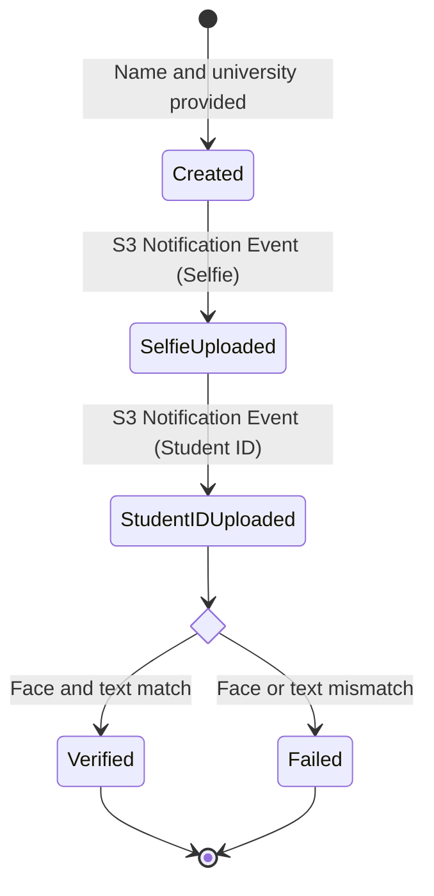

# API

Guiding principles:

- RESTful API
- JSON as the primary data format
- Event-driven architecture
- Strongly asynchronous

## Public Endpoints

| Endpoint                         | Description                                       |
| -------------------------------- | ------------------------------------------------- |
| `POST /session`                  | Create a new session, returns a session ID        |
| `GET /session`                   | Get all sessions, supports pagination             |
| `GET /session/{id}`              | Get a session by ID                               |
| `POST /presigned-url/selfie`     | Create a presigned URL for uploading a file to S3 |
| `POST /presigned-url/student-id` | Create a presigned URL for uploading a file to S3 |

## Internal Lambda Functions

| Function            | Description                                |
| ------------------- | ------------------------------------------ |
| `upload-selfie`     | Upload a selfie to S3                      |
| `upload-student-id` | Upload a student ID to S3                  |
| `extract-text`      | Extract text from an image                 |
| `extract-face`      | Extract a face from an image               |
| `compare-faces`     | Compare two faces                          |
| `update-status`     | Update the verification status in DynamoDB |

## State Machine

## Verification Flow

