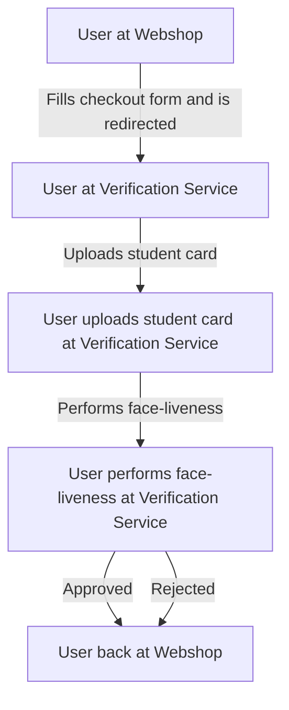

# Design

## User flows

In this project, we propose to create a *student verification service*.
Specifically, we want to develop a SaaS that verifies student status for online businesses that want to offer discounts, similar to know-your-customer (KYC) processes in enterprises.

We propose the following pipeline for student verification, from the customers point-of-view.

1. The student fills out form data (e.g., name, email, university, and expiration) in the customer application.
2. The customer application is redirected to our service.
3. The student uploads a picture of their student card.
4. The student performs a face-liveness and selfie-extraction pipeline.
5. The student status is computed, and the student is redirected back to the customer application.

## Technical flow

1. We extract text from the student card to verify against the form data
2. We extract a picture of the student from the student card
3. We extract a selfie from the face-liveness check
4. We perform face similarity for the extracted faces.

## Architecture diagram

## Design limitations

- New IAM roles could not be created, thus we could not design custom role to exercise least-privellege desifn and other secuirty aspects
- The `LabRole` IAM role, was restristed naad in our initial design of the API, we
- CI/CD was hard to implement, as the AWS Credentials rotated each 4 hours and had to be extracted manually through the LearnerLab console
- FaceLiveness could not be implemented, as we did not have permission to `StartFaceLiveness` with the `LabRole` IAM role

## Improvements

- Instead of mixing data (e.g. name and univeristy) and state (Are faces matching), we could model the data seperately from the verification session state thorugh:
    - Data in DynamoDB, session state in a state machine (e.g. AWS Step Functions)
    - Data in DynamoDB, session events in a event store (e.g. AWS EventBridge) or in DynamoDB and using event sourcing
- CI/CD could be implemented by using AWS Secrets Manager to store the AWS Credentials and using AWS CodePipeline to deploy the API

##